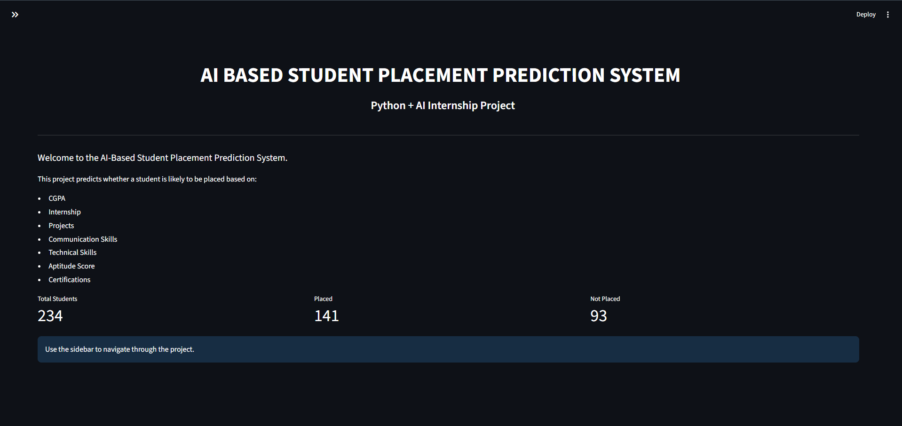
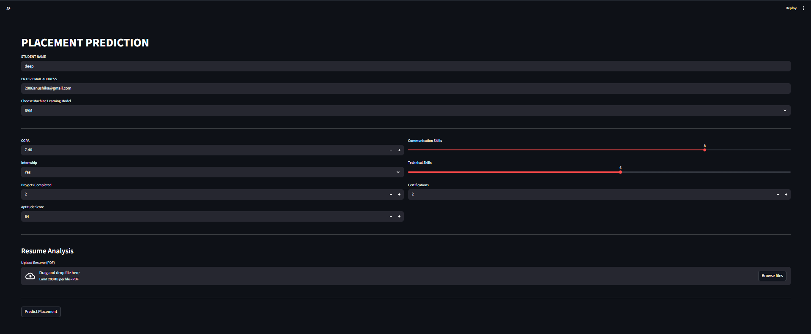
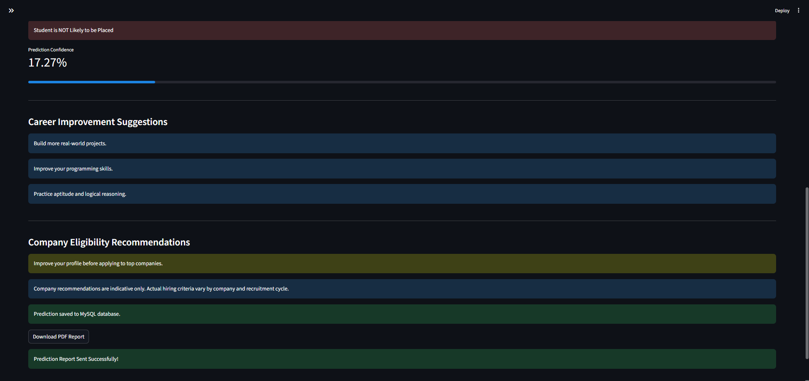
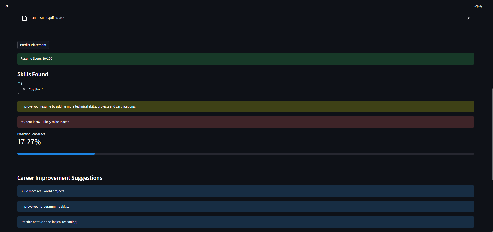
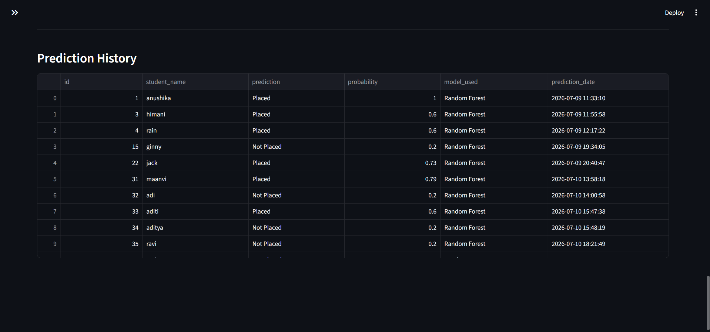
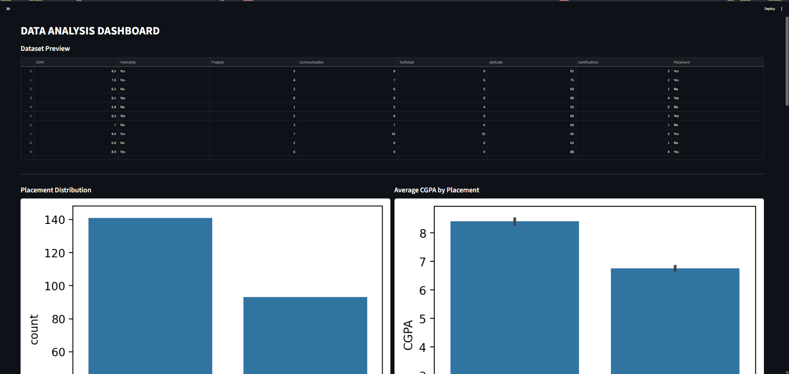
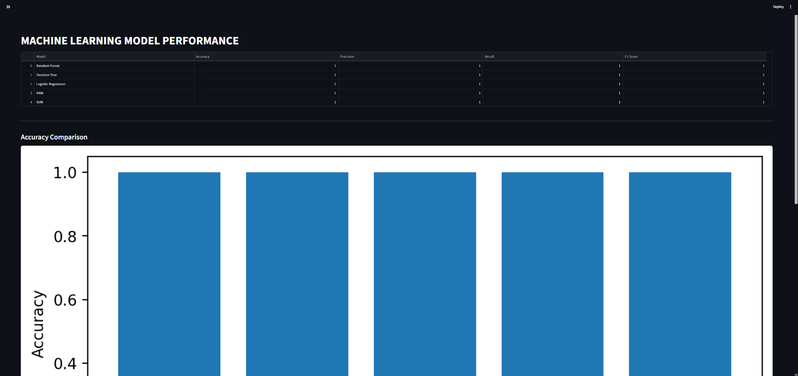
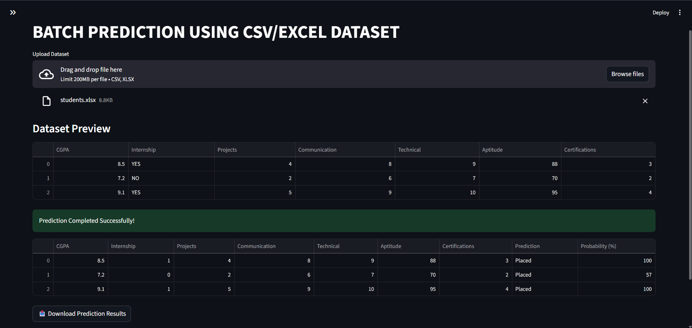
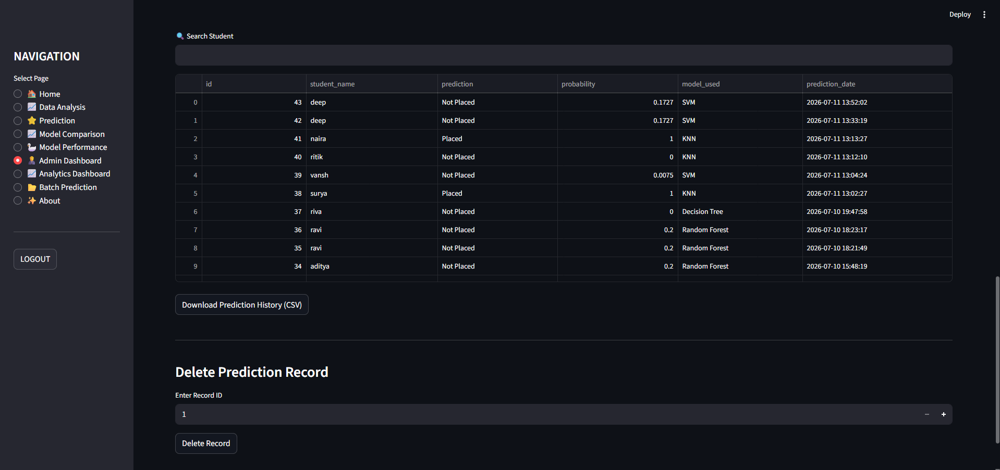
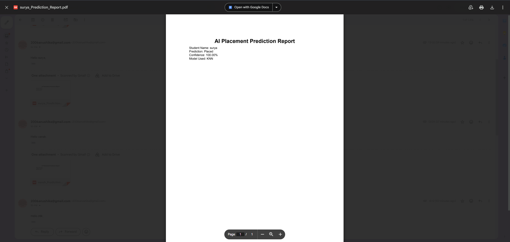

# AI BASED STUDENT PLACEMENT PREDICTION SYSTEM
#  AI Placement Prediction System


##  PROJECT OVERVIEW

The **AI-Based Student Placement Prediction System** is a Machine Learning web application developed using **Python** and **Streamlit**. It predicts whether a student is likely to be placed based on academic and skill-related factors such as CGPA, internship experience, projects, communication skills, technical skills, aptitude score, and certifications.

The system also provides career improvement suggestions, company eligibility recommendations, resume analysis, prediction reports in PDF format, email notifications, analytics dashboards, and batch prediction using CSV/Excel files.

---
# KEY HIGHLIGHTS

## ⭐ Key Highlights

- Machine Learning based Placement Prediction
- 4 Trained ML Models
- Railway Cloud MySQL Integration
- Resume Analysis
- PDF Report Generation
- Email Notifications
- Batch Prediction
- Analytics Dashboard
- Admin Dashboard
- Live Deployment using Streamlit Community Cloud


#  FEATURES

###  STUDENT FEATURES
-  Placement Prediction using Machine Learning
-  Resume Analysis
-  Email Notification with PDF Report
-  PDF Report Generation
-  Model Performance Comparison
-  Analytics Dashboard
-  Admin Dashboard
-  Student Access (No Login Required)
-  Secure Admin Login
-  Railway Cloud MySQL Database Integration
-  Prediction History Storage
-  Batch Prediction using CSV Upload
-  Company Recommendations
-  Career Improvement Suggestions
-  Live Streamlit Deployment

###  ADMIN FEATURES
- View Prediction History
- Search Student Records
- Delete Prediction Records
- Download Prediction History (CSV)

###  ANALYTICS FEATURES
- Placement Statistics Dashboard
- Pie Chart Visualization
- Prediction History Analysis
- Model Performance Metrics
  - Accuracy
  - Precision
  - Recall
  - F1-Score

###  BATCH PREDICTION
- Upload CSV Dataset
- Upload Excel Dataset
- Predict Placement for Multiple Students
- Download Prediction Results

---

# TECH STACK

Python

Streamlit

Scikit-learn

Pandas

NumPy

Matplotlib

Seaborn

Plotly

MySQL

Railway Cloud

ReportLab

PyPDF2

pdfplumber

Yagmail

Git

GitHub

# MACHINE LEARNING MODELS USED
The application supports the following trained Machine Learning models:
-  Random Forest
-  Decision Tree
-  K-Nearest Neighbors (KNN)
-  Support Vector Machine (SVM)

Users can compare the performance of each model using the built-in Model Comparison dashboard.

---

# TECHNOLOGIES USED

### Programming Language
- Python

### Frontend
- Streamlit

### Machine Learning
- Scikit-learn

### Data Analysis
- Pandas
- NumPy

### Visualization
- Matplotlib
- Seaborn
- Plotly

### Database
- MySQL
- Railway Cloud MySQL

### PDF Generation
- ReportLab

### Resume Analysis
- PyPDF2
- pdfplumber

### Email Service
- Yagmail

### Version Control
- Git
- GitHub

# PROJECT STRUCTURE

placement-prediction-system/
│
├── app.py
├── database.py
├── email_sender.py
├── requirements.txt
├── README.md
│
├── models/
│   ├── random_forest.pkl
│   ├── decision_tree.pkl
│   ├── knn.pkl
│   ├── svm.pkl
│   └── model_results.csv
│
├── reports/
│   └── pdf_report.py
│
├── resume/
│   └── resume_analyzer.py
│
├── users/
│   ├── admin.py
│   └── login.py
│
├── screenshots/
└── .streamlit/

# PROJECT WORKFLOW

Student Details
        ↓
Resume Upload
        ↓
Resume Analysis
        ↓
Machine Learning Prediction
        ↓
Prediction Probability
        ↓
Career Suggestions
        ↓
Company Recommendations
        ↓
Generate PDF
        ↓
Send Email
        ↓
Save to Railway Database

# FOLDER STRUCTURE

app.py
database.py
email_sender.py
requirements.txt
models/
reports/
resume/
users/
screenshots/
.streamlit/

# MACHINE LEARNING WORKFLOW

1. Data Collection
2. Data Cleaning
3. Feature Selection
4. Model Training
5. Model Evaluation
6. Prediction
7. PDF Report Generation
8. Email Notification
9. Database Storage

# INSTALLATION

### Clone the repository

```bash
git clone https://github.com/anushi-arch/placement-prediction-system.git
```

### Navigate to the project

```bash
cd placement-prediction-system
```

### Install dependencies

```bash
pip install -r requirements.txt
```

### Configure MySQL

Create a database:

```sql
CREATE DATABASE placement_ai;
```

Update the database credentials in `database.py`.

### Configure Email

Create:

```text
.streamlit/secrets.toml
```

Add:

```toml
EMAIL = "youemail@gmail.com"
PASSWORD = "........"
```

### Run the application

```bash
streamlit run app.py
```

---

# MODEL PERFORMANCE

The application displays the following evaluation metrics:

- Accuracy
- Precision
- Recall
- F1-Score

These metrics help compare the performance of different machine learning models.

---

# DASHBOARD

The Analytics Dashboard provides:

- Total Predictions
- Placed Students
- Not Placed Students
- Placement Percentage
- Pie Chart Visualization
- Prediction History

---

# AUTHENTICATION

### Student

Students can access the application directly without creating an account.

Features available:
- Placement Prediction
- Resume Analysis
- PDF Report
- Email Report
- Career Suggestions

### Administrator

### Student

Students can access the application directly without creating an account.

Features available:
- Placement Prediction
- Resume Analysis
- PDF Report
- Email Report
- Career Suggestions

### Administrator

Administrator login is protected and provides access to:

- Analytics Dashboard
- Prediction History
- Database Records

# DATABASE

## 🗄️ Database

The application stores prediction history in a Railway-hosted MySQL database.

Stored Information:
- Student Name
- Prediction Result
- Prediction Probability
- Selected Machine Learning Model
- Timestamp

# EMAIL NOTIFICATION

After a prediction is generated:

- A PDF report is created.
- The report can be downloaded.
- The report can also be emailed directly to the student's email address.

---

# PDF REPORT

Each report contains:

- Student Name
- Selected Machine Learning Model
- Prediction Result
- Prediction Confidence
- Generated Date

---

# BATCH PREDICTION

The application supports bulk predictions by uploading:

- CSV files
- Excel (.xlsx) files

The output includes:

- Prediction
- Probability (%)

Users can download the results as a CSV file.

---

# SCREENSHOTS

##  Home Page



---

## Placement Prediction



---

## Prediction Result



---

## Resume Analysis



---

## Analytics Dashboard



---

## Data Analysis



---

## Model Performance



---

## Batch Prediction



---

## Admin Dashboard



---

## Email Notification


Add screenshots of the following pages:


---
# LIVE DEMO

## 🚀 Live Demo

Streamlit App:

https://placement-predictions.streamlit.app/

# LIMITATIONS

- Predictions depend on the quality of the training dataset.
- Resume analysis is keyword-based and not full NLP.
- Company recommendations are rule-based.
- Email notifications require Gmail App Password configuration.
- The system is intended for educational purposes.

---

# FUTURE ENHANCEMENT

## 🌟 Future Enhancements

- Student Registration System
- Password Hashing
- Resume Score Enhancement
- AI-based Resume Feedback
- Company-wise Placement Analysis
- Placement Trend Prediction

---

# DEVELOPED BY

ANUSHIKA
BCA-III
7031/24
PGGC-11
Panjab University

Python & AI Internship Project

---

# LICENSE

This project is developed for educational and learning purposes.

# FINAL DESCRIPTION

## 📌 Project Overview

The AI Placement Prediction System is a Machine Learning-based web application developed using Streamlit. It predicts a student's placement chances based on academic and skill-related inputs. The application includes resume analysis, company recommendations, career improvement suggestions, PDF report generation, email notifications, batch prediction, analytics dashboard, and secure admin access. Prediction history is stored in a Railway-hosted MySQL database, and the application is deployed on Streamlit Community Cloud.